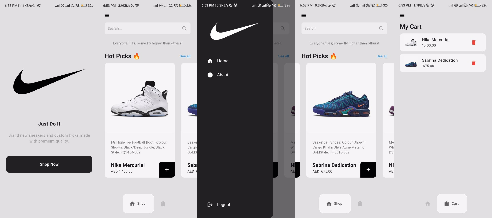

An E-Commerce App For Buying Sneakers.
# Sneaker Shop 👟

An E-Commerce App for Buying Sneakers.

## Overview

Sneaker Shop is a Flutter application designed for buying sneakers. It provides a seamless shopping experience with a modern UI and easy navigation.

## Features

- **Browse Sneakers**: Explore a wide range of sneakers with detailed descriptions and images.
- **Swipe**: Find your favorite sneakers using Swipe.
- **Shopping Cart**: Add sneakers to your cart.

## Getting Started

### Prerequisites

- Flutter SDK: `>=3.4.3 <4.0.0`
- Dart SDK

### Installation

1. **Clone the repository:**

   ```bash
   git clone https://github.com/Rahulbalakrishnan/Nike-Sneaker-Shop.git
   cd Nike-Sneaker-Shop
   ```

2. **Install dependencies:**

   ```bash
   flutter pub get
   ```

3. **Run the application:**

   ```bash
   flutter run
   ```

## Dependencies

- **flutter:** `sdk: flutter`
- **cupertino_icons:** `^1.0.6`
- **google_nav_bar:** `^5.0.6`
- **provider**

## Dev Dependencies

- **flutter_test:** `sdk: flutter`
- **flutter_lints:** `^3.0.0`

## Assets

- **Images:** Located in `lib/images/`

Happy Sneaker Shopping! 👟🛒

---

